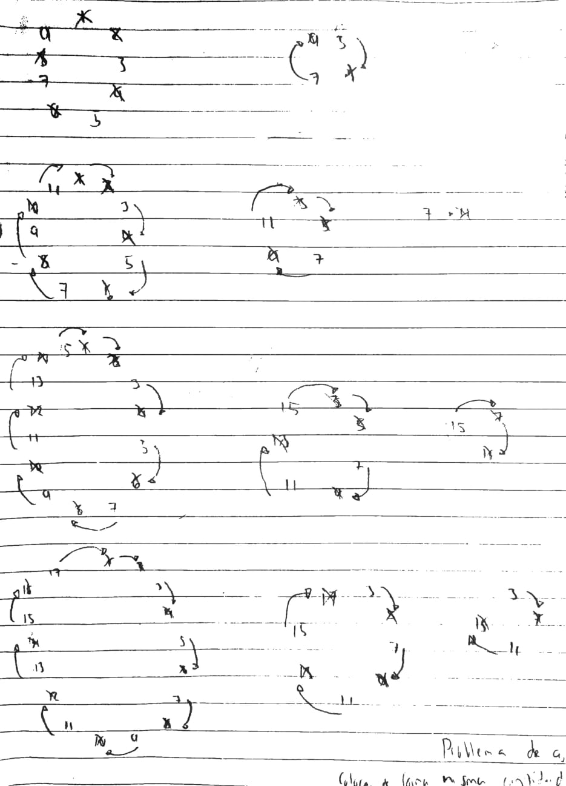
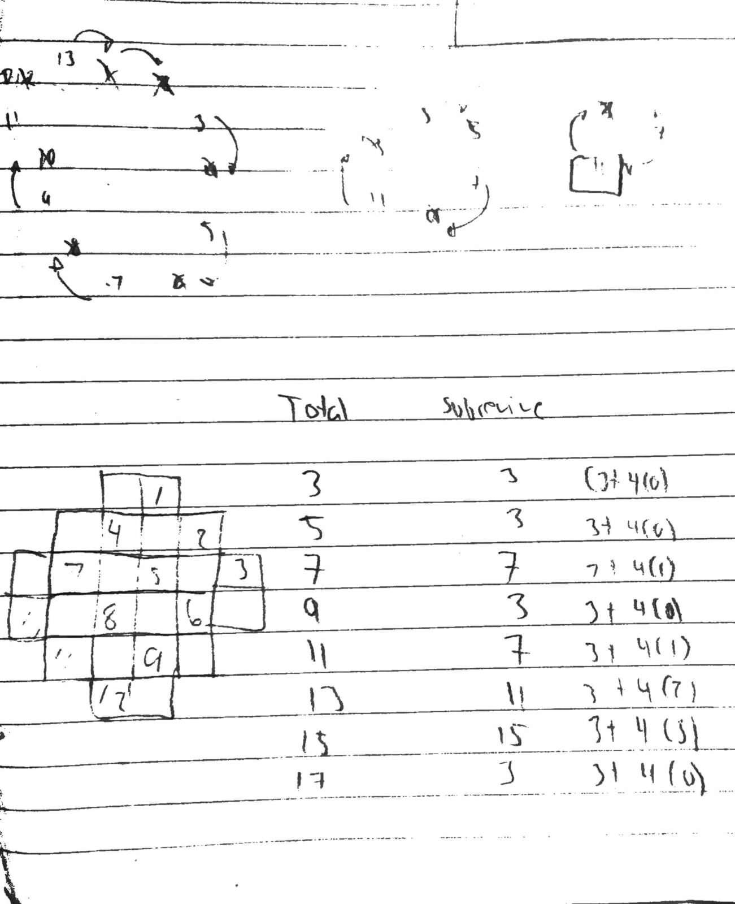

# Problema cueva

Se encuentras unos esclavos en una cueva atrapados, para mantener su honor deciden matarse entre ellos, pero uno quiere sobrevivir. En que posicion debe colacarse quien quiere sobrevivir para mantenerse con vida si dicidieron que cada persona matara a quien se encuentra a su derecha, de manera sucesiva hasta que ya no quede nadie.

