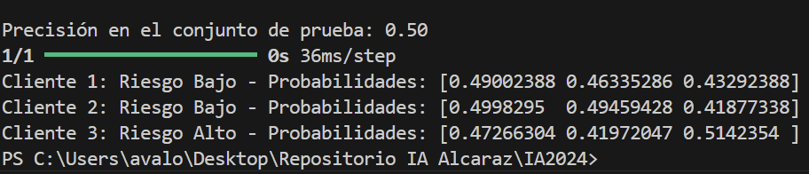

# Problema: Clasificación de Clientes según su Perfil Financiero
## Descripción del Problema
Una institución financiera desea clasificar a sus clientes en tres categorías basándose en su perfil financiero y de comportamiento:

- Riesgo Bajo: Clientes que cumplen con todos los pagos a tiempo y tienen ingresos estables.
- Riesgo Medio: Clientes con retrasos esporádicos en los pagos o ingresos variables.
- Riesgo Alto: Clientes con historial de impagos o ingresos inestables.
  
### Características de Entrada:

- Historial de pagos: Porcentaje de pagos realizados a tiempo (normalizado entre 0 y 1).
- Ingresos mensuales: Ingresos promedio del cliente (normalizado entre 0 y 1).
- Relación deuda-ingreso: Proporción entre la deuda total y los ingresos totales (normalizado entre 0 y 1).
### Categorías de Salida:

- `Riesgo Bajo`: [1, 0, 0]
- `Riesgo Medio`: [0, 1, 0]
- `Riesgo Alto`: [0, 0, 1]

## Conjunto de Datos de Entrenamiento
Historial de pagos	Ingresos mensuales	Relación deuda-ingreso	Resultado
0.9	0.8	0.2	[1, 0, 0]
0.7	0.6	0.5	[0, 1, 0]
0.4	0.4	0.8	[0, 0, 1]
0.8	0.9	0.3	[1, 0, 0]
0.5	0.7	0.6	[0, 1, 0]
0.3	0.5	0.9	[0, 0, 1]

## Actividades
- Implementar una red neuronal multicapa para clasificar los clientes según su riesgo.
- Encontrar los valores óptimos para los pesos `w1`, `w2` 'wn' y el sesgo `b` mediante entrenamiento.
- Graficar la frontera de decisión que separa los clientes .
- ¿Son los datos linealmente separables?
- ¿Qué ajustes podrían hacer al modelo para mejorar la clasificación?
- Describir cada una de las partes del modelo implementando

## Colocar los datos de entrenamiento
```python
# Datos de entrenamiento
X = np.array([
    [0.9, 0.8, 0.2],
    [0.7, 0.6, 0.5],
    [0.4, 0.4, 0.8],
    [0.8, 0.9, 0.3],
    [0.5, 0.7, 0.6],
    [0.3, 0.5, 0.9]
])

Y = np.array([
    [1, 0, 0],  
    [0, 1, 0],  
    [0, 0, 1],  
    [1, 0, 0],
    [0, 1, 0],
    [0, 0, 1]
])
```

## Separar entre datos de entrenamiento y prueba
```python
X_train, X_test, y_train, y_test = train_test_split(X, Y, test_size=0.2, random_state=42)
```

## Crear modelo 
Se genera el modelo, se tiene una entrada de 3 dimensiones, y la salida 3 neuronas una para cada clase (Riesgo bajo, medio y alto)
```python
model = Sequential([
Dense(4, input_dim=3, activation='relu'), 
Dense(3, activation='sigmoid')
])
```

## Compilar y entrenar el modelo
```python
model.compile(optimizer='adam', 
              loss='categorical_crossentropy', 
              metrics=['accuracy'])

model.fit(X_train, y_train, epochs=20, batch_size=32, verbose=1)

```

## Evaluar modelo
Se evalua el modelo, luego se prueba el modelo con 3 datos de entrada
```python
loss, accuracy = model.evaluate(X_test, y_test, verbose=0)
print(f"\nPrecisión en el conjunto de prueba: {accuracy:.2f}")

# Predicción con nuevos datos
pruebas = np.array([
    [0.85, 0.8, 0.2],
    [0.7, 0.6, 0.5],
    [0.4, 0.4, 0.8],
])

prediccion = model.predict(pruebas)
categorias = ['Riesgo Bajo', 'Riesgo Medio', 'Riesgo Alto']

for i, pred in enumerate(prediccion):
    print(f"Cliente {i+1}: {categorias[np.argmax(pred)]} - Probabilidades: {pred}")
```
## Ejemplo de la salida
Al tenerse tan pocos datos los datos que genera no son muy precisos.

