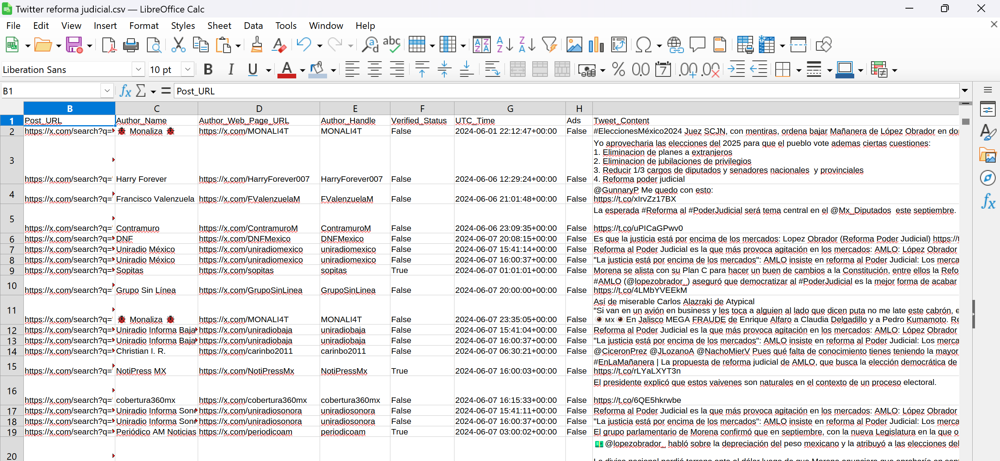
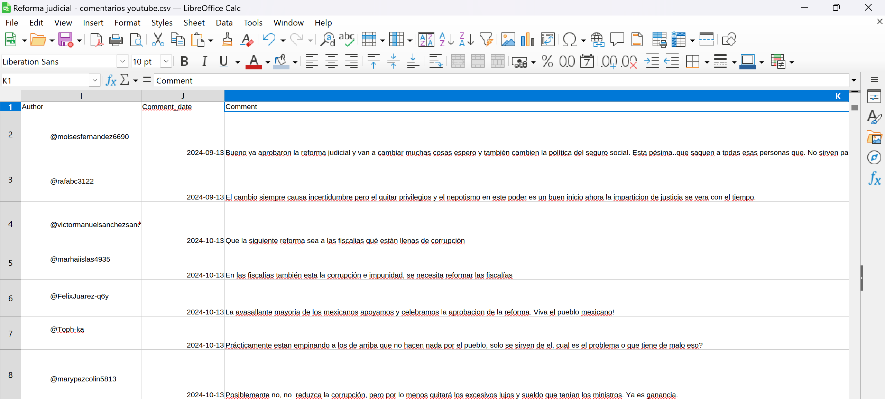
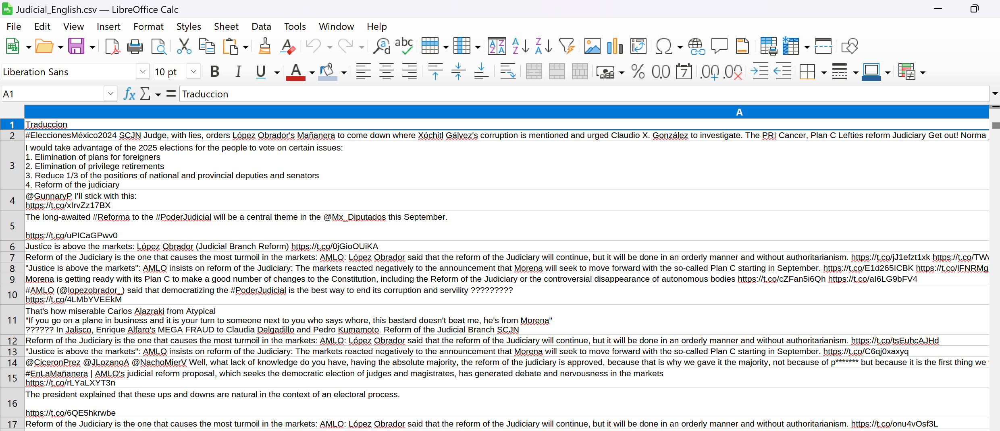
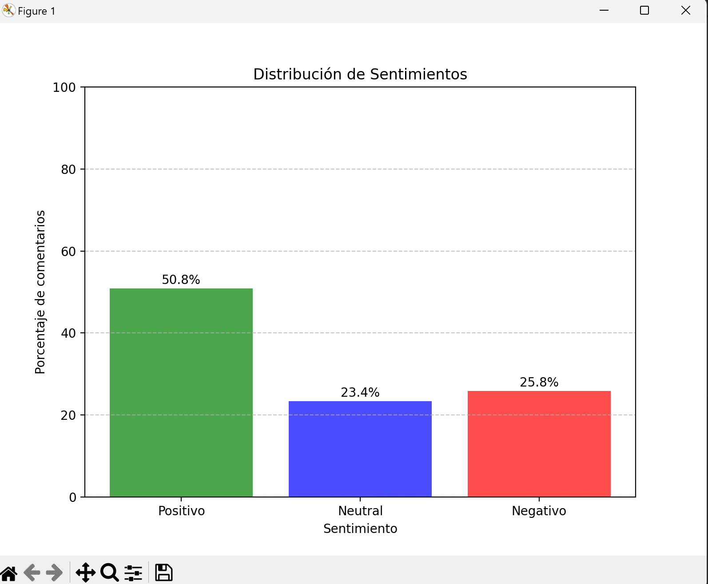
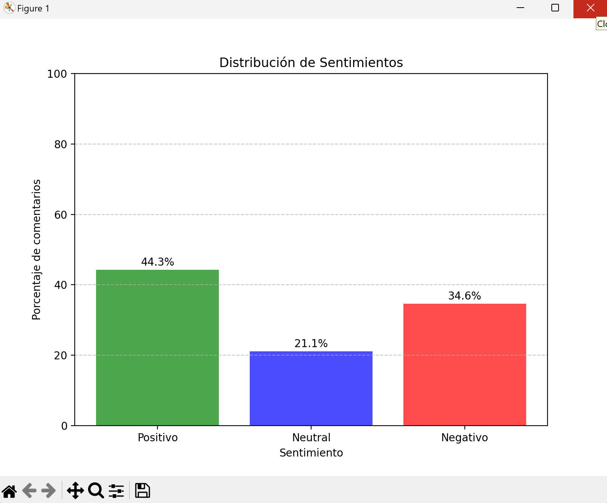
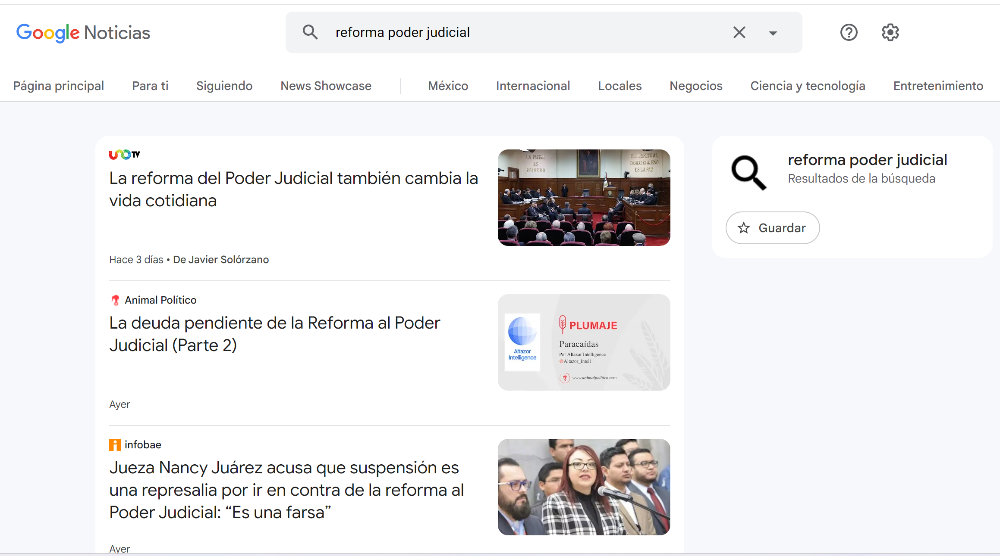
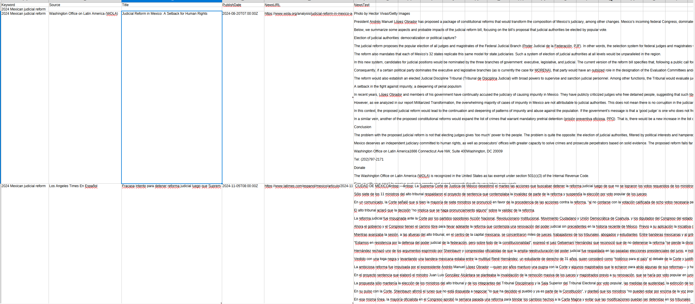
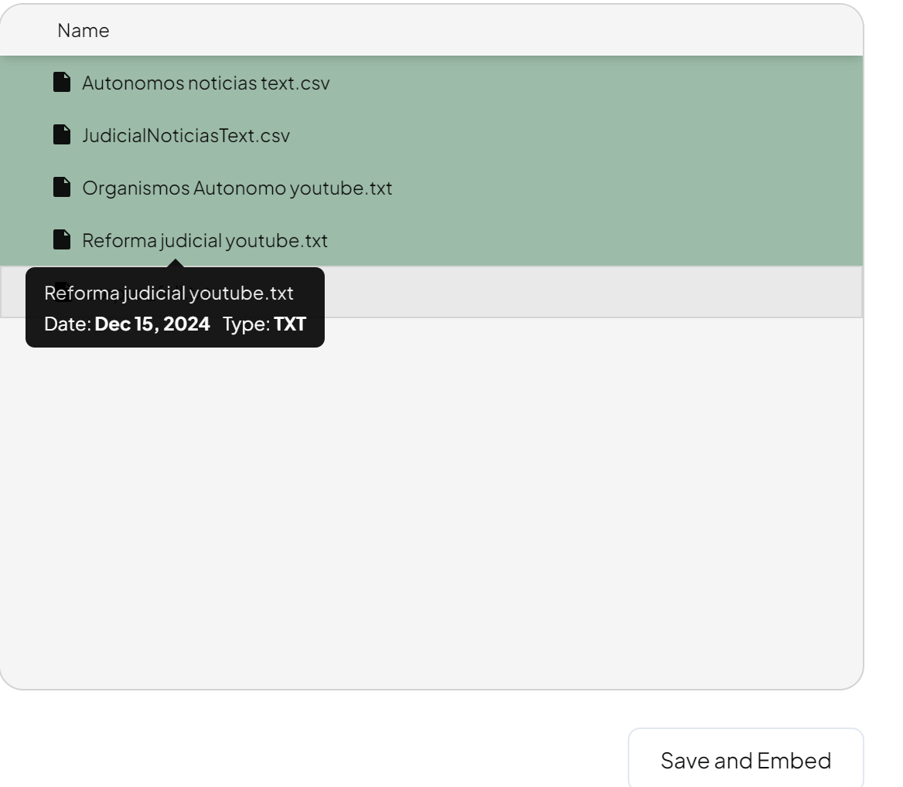
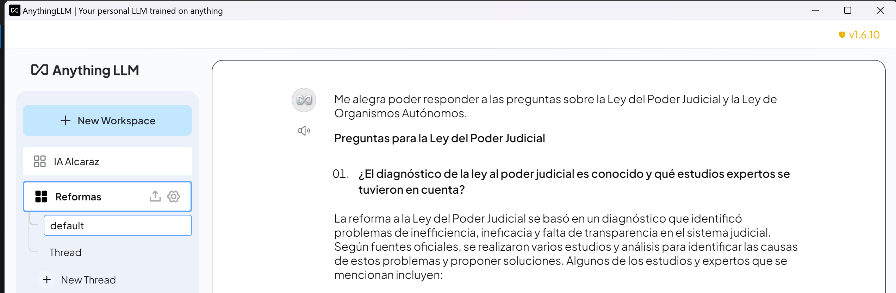

# Proyecto 4: Análisis a la Reforma Judicial y Organismos Autónomos mediante IA

Este proyecto tiene como objetivo analizar las percepciones y opiniones relacionadas con la Reforma al Poder Judicial y la desaparición de organismos autónomos en México, utilizando herramientas de análisis de lenguaje y modelos de lenguaje extenso (LLMs).

# 1. Recolección de Información
Se recopilaron datos de redes sociales como YouTube y Twitter, enfocados en videos y publicaciones sobre el tema. Esto permitió obtener una perspectiva general de las opiniones del público respecto a estas reformas.

### Ejemplo de información recopilada
#### Comentarios en Twitter:


#### Comentarios en YouTube:


---

# 2. Análisis de Sentimiento
Se realizó un análisis de sentimiento para determinar si las opiniones del público eran positivas, negativas o neutrales. Para ello, se utilizó la biblioteca NLTK y el modelo VADER. Debido a que VADER opera solo con textos en inglés, primero se tradujeron los comentarios utilizando el API Translator de Azure.

### Traducción de los datos
#### Script utilizado para la traducción:
```python
import csv
import requests
import uuid

def translate_text(subscription_key, endpoint, region, text, target_language):
    path = '/translate?api-version=3.0'
    params = f'&to={target_language}'
    constructed_url = endpoint + path + params

    headers = {
        'Ocp-Apim-Subscription-Key': subscription_key,
        'Ocp-Apim-Subscription-Region': region,
        'Content-type': 'application/json',
        'X-ClientTraceId': str(uuid.uuid4())
    }

    body = [{
        'text': text
    }]

    response = requests.post(constructed_url, headers=headers, json=body)
    response.raise_for_status()

    translations = response.json()
    return translations[0]['translations'][0]['text']

def translate_csv(input_csv, output_csv, subscription_key, endpoint, region, target_language, start_line=0):
    with open(input_csv, 'r', encoding='latin1') as infile, open(output_csv, 'w', encoding='utf-8', newline='') as outfile:
        reader = csv.DictReader(infile)
        fieldnames = reader.fieldnames + ['Traduccion']
        writer = csv.DictWriter(outfile, fieldnames=fieldnames)
        writer.writeheader()

        # Saltamos las líneas anteriores a 'start_line'
        for i, row in enumerate(reader):
            if i < start_line:
                continue  # Si la línea es antes de la línea de inicio, saltarla

            original_comment = row['Comentarios']
            translated_comment = translate_text(subscription_key, endpoint, region, original_comment, target_language)
            row['Traduccion'] = translated_comment
            writer.writerow(row)

if __name__ == "__main__":
    # Configuración de la API
    subscription_key = "my_key"  # Reemplaza con tu clave de suscripción
    endpoint = "https://api.cognitive.microsofttranslator.com/"  # Endpoint de Azure Translator
    region = "eastus"  # Reemplaza con tu región

    # Archivos de entrada y salida
    input_csv = r"PR4-Reforma_Judicial\Organismos_Comentarios.csv"  # Archivo de entrada con la columna 'Comentarios'
    output_csv = 'Organismos_traducidos2.csv'  # Archivo de salida

    # Idioma de destino para la traducción
    target_language = 'en'  # Cambia esto según el idioma deseado, por ejemplo, 'es', 'fr', etc.

    # Línea desde la que empezar la traducción (por ejemplo, empieza desde la línea 10)
    start_line = 2007

    translate_csv(input_csv, output_csv, subscription_key, endpoint, region, target_language, start_line)
    print(f"Archivo traducido guardado en: {output_csv}")

```

#### Ejemplo de información traducida:


---

### Procesamiento del Análisis de Sentimiento
Una vez traducidos los datos, se procedió al análisis de sentimiento. Este código clasifica los comentarios como positivos, negativos o neutros, y luego visualiza las proporciones usando la biblioteca Matplotlib.

#### Script para el análisis de sentimiento:
```python
import pandas as pd
from nltk.sentiment import SentimentIntensityAnalyzer
import nltk
import matplotlib.pyplot as plt

# Descargar lexicón de VADER 
nltk.download('vader_lexicon')

sia = SentimentIntensityAnalyzer()

# Leer archivo CSV
def load_comments(csv_file):
    df = pd.read_csv(csv_file, encoding='latin1')
    if "Traduccion" not in df.columns:
        raise ValueError("El archivo CSV no tiene una columna llamada 'Traduccion'")
    return df["Traduccion"].dropna().tolist()

# Analizar sentimientos y contar comentarios positivos, neutrales y negativos
def analyze_sentiments(comments):
    sentiment_counts = {'pos': 0, 'neu': 0, 'neg': 0}
    
    print("Puntuaciones por comentario:")
    for idx, comment in enumerate(comments, start=1):
        scores = sia.polarity_scores(comment)
        print(f"Comentario {idx}: {scores}")  # Imprime las puntuaciones del comentario
        
        compound_score = scores['compound']
        if compound_score >= 0.05:
            sentiment_counts['pos'] += 1
        elif compound_score <= -0.05:
            sentiment_counts['neg'] += 1
        else:
            sentiment_counts['neu'] += 1
    
    total_comments = len(comments)
    
    # Calcular porcentajes
    sentiment_percentages = {key: (count / total_comments) * 100 for key, count in sentiment_counts.items()}
    return sentiment_percentages

# Graficar los resultados
def plot_sentiment_analysis(sentiment_percentages):
    labels = ['Positivo', 'Neutral', 'Negativo']
    values = [sentiment_percentages['pos'], sentiment_percentages['neu'], sentiment_percentages['neg']]

    plt.figure(figsize=(8, 6))
    bars = plt.bar(labels, values, color=['green', 'blue', 'red'], alpha=0.7)
    plt.title('Distribución de Sentimientos')
    plt.xlabel('Sentimiento')
    plt.ylabel('Porcentaje de comentarios')

    # Añadir los valores de porcentaje sobre las barras
    for bar in bars:
        yval = bar.get_height()
        plt.text(bar.get_x() + bar.get_width() / 2, yval + 0.5, f'{yval:.1f}%', ha='center', va='bottom')

    plt.ylim(0, 100)  # Los porcentajes van de 0 a 100
    plt.grid(axis='y', linestyle='--', alpha=0.7)
    plt.show()

# Main
if __name__ == "__main__":
    csv_file = r"PR4-Reforma_Judicial\Judicial_English.csv"  # CSV comentarios y tweets
    try:
        comments = load_comments(csv_file)
        sentiment_percentages = analyze_sentiments(comments)

        print("\nAnálisis de sentimientos completado:")
        print(f"Porcentaje de comentarios positivos: {sentiment_percentages['pos']:.1f}%")
        print(f"Porcentaje de comentarios neutrales: {sentiment_percentages['neu']:.1f}%")
        print(f"Porcentaje de comentarios negativos: {sentiment_percentages['neg']:.1f}%")

        # Graficar los resultados
        plot_sentiment_analysis(sentiment_percentages)
    except Exception as e:
        print(f"Error: {e}")

```

---

# 3. Resultados del Análisis de Sentimiento
Los resultados obtenidos muestran la distribución de sentimientos respecto a cada tema.

### Sentimiento general sobre la Reforma al Poder Judicial:


### Sentimiento general sobre la desaparición de organismos autónomos:


---

## Conclusiones del analisis
Este análisis permitió obtener una visión de lo que opina el publico general al respecto a las reformas mencionadas. De la reforma judicial podemos observa que aunque la unpoco mas de la mitad de comentarios (50.4%) tienen un sentimiento positivo, tambien una parte no insignificante de comentarios (25.8%) muestran un desagrado a hacia la reforma. La desaparicion de organismos autonomos muestra una tendencia todavia mas negativa, ya que solo un 44.3% de comentarios muestran una actitud positiva, mientras que los comentarios negativos llegan hasta un 34.6%


# 4. Recopilacion de informacion para LLM
Para recopilar informacion que pueda usar el LLM para contestar nuestras preguntas se recopiló información de varios noticieron usando el portal de google news, que nos proporciona una gran cantidad de informacion que han ido sacando los mas grandes noticieros del pais. Tambien se extrajó informacion de posdcast y debates de youtube que hablan sobre el tema, se extrajeron los subtitulos y se le proporcionaron en el corpus a nuestro LLM.


### Portal de google news:


## Ejemplo de información recopilada:


# 5. Preparar el LLM
Para el uso del LLM de forma local se uso la herramienta AnythingLLM, que nos proporciona una interfaz grafica intuitiva y facil de usar, asi como una suite de herramientas para facilitar el trabajo. Una vez instalado tambien bajamos el modelo de LLaMa 3.2.


## Proporcionar corpus
Dentro del mismo AnythingLLM se tiene la opcion de pasar uno o varios documentos que le serviran como fuente de información al LLM al momento de hacer las preguntas, le pasamos tanto las noticias como las transcripciones de los videos de youtube para que tenga una basta fuente de conocimiento.


Sin embargo el LLM no puede trabajar con los archivos directamente, es por ello que AnythingLLM tambien cuenta con la opcion de transformar los archivos en embeddings y proporcionarselos al LLM para que posteriormente pueda contestar nuestras preguntas.



# 6. Contestar preguntas.
Ahora que ya se tiene el modelo descargado y se la proporcionado embeddings con el contexto de la situacion es momento de usar nuestro LLM para contestar las preguntas planteadas en el proyecto. Asi se ve la interfaz grafica del modelo




### Preguntas para la Ley del Poder Judicial
1. ¿El diagnóstico de la ley al poder judicial es conocido y qué estudios expertos se tuvieron en cuenta?
   
 **Respuesta LLaMa:**
```plaintext
Según la información disponible, el diagnóstico de la ley al Poder Judicial en México fue realizado a través de varios estudios y análisis llevados a cabo por expertos internacionales y nacionales.

Algunos de los estudios y análisis que se mencionan incluyen:

* El estudio "Diagnóstico del Poder Judicial" elaborado por el Instituto Nacional de Estudios Jurídicos (INEJ) en 2019, que identificó problemas de profesionalismo, independencia y eficiencia en la Administración de Justicia.
* La evaluación del Sistema de Carrera Judicial realizada por el Instituto Mexicano para la Competitividad (IMCO) en 2020, que encontró deficiencias en la selección, capacitación y promoción de jueces y magistrados.
* El informe "Reforma del Poder Judicial" elaborado por la Comisión Nacional de Derechos Humanos (CNDH) en 2019, que recomendó reformas para mejorar la independencia, eficiencia y profesionalismo del Poder Judicial.

En cuanto a los expertos que se tuvieron en cuenta en el diagnóstico, se mencionan:

* Expertos internacionales de organizaciones como la Organización de las Naciones Unidas (ONU) y el Banco Mundial.
* Académicos y especialistas en derecho y administración de justicia de universidades y centros de investigación nacionales e internacionales.
* Representantes de organizaciones no gubernamentales (ONG) que trabajan en materia de derechos humanos y justicia.

Es importante destacar que la información disponible no proporciona una lista exhaustiva de los estudios, expertos y análisis que se llevaron a cabo para realizar el diagnóstico. Sin embargo, parece que se tuvieron en cuenta varias fuentes y perspectivas para abordar las necesidades y desafíos del Poder Judicial en México.
```
 **Análisis y opinion:** LLaMa menciona que es una reforma que si tiene fundamentos en problemas que se habian observado con anterioridad, por lo que la implementación de esta reforma no es completamente negativa como aseguran algunas fuentes opositoras.

2. ¿Por qué la reforma no incluyó a las fiscalías y a la defensoría, limitándose solo al poder judicial?
   
 **Respuesta LLaMa:**

```plaintext
Basándome en mi conocimiento sobre la reforma judicial, puedo decir que la reforma se centró únicamente en el Poder Judicial debido a varias razones:

1. **Prioridad política**: La reforma fue impulsada por el gobierno actual, y su principal objetivo era consolidar su poder y control sobre el Poder Judicial. Limitarse al Poder Judicial permitió al gobierno concentrar sus esfuerzos en un solo ramo del sistema de justicia.
2. **Intereses políticos**: La inclusión de las fiscalías y la defensoría habría requerido compromisos con otros actores políticos, lo que podría haber debilitado la posición del gobierno actual dentro del proceso de reforma.
3. **Foco en la independencia judicial**: La reforma se centró principalmente en fortalecer la independencia del Poder Judicial, lo cual es considerado fundamental para garantizar la imparcialidad y equidad en el sistema de justicia. La inclusión de las fiscalías y la defensoría podría haber diluido este objetivo principal.
4. **Problemas de implementación**: Incluir a las fiscalías y la defensoría en la reforma habría requerido un cambio más profundo en la estructura y funcionamiento del sistema de justicia, lo que puede ser un proceso más complicado y requiere más tiempo.

Sin embargo, es importante destacar que la exclusión de las fiscalías y la defensoría ha sido criticada por muchos expertos y actores sociales, quienes consideran que la reforma no aborda los problemas estructurales y sistémicos que afectan a todo el sistema de justicia. La inclusión de estas instituciones en la reforma podría haber ayudado a abordar problemas como la corrupción, la ineficiencia y la falta de transparencia en las fiscalías y la defensoría.
```

 **Análisis y opinion:** LLaMa menciona que incluir los demas poderes probablemente habría dificultado el proceso, sin embargo tambien es cierto que se algunas de estas exlcusiones se hicieron con fines politicos, por que como ciudadanos debemos mantenernos atentos a que no haya abusos de poder en la implementación de esta reforma.

3. ¿Qué medidas concretas se implementarán para evitar la captación del crimen organizado y la violencia en el contexto electoral?

 **Respuesta LLaMa:**

```plaintext
Se han anunciado varias medidas para prevenir la captura del crimen organizado y la violencia en el poder judicial, incluyendo:

La creación de un Tribunal de Disciplina Judicial que tenga facultades amplias para supervisar y sancionar al personal judicial.
La implementación de un sistema de evaluación y seguimiento del desempeño de los jueces y magistrados.
La promoción de la transparencia y la rendición de cuentas en el poder judicial.
```
 **Análisis y opinion:** LLaMa numera varias medidas que se proponen que suenan bastante bien para evitar que el crimen organizado se involucre en el poder judicial, pero tambien se tendre que poner a prueba si estas medidas realmente estan funcionando o no.


4. ¿Cómo garantizar que juristas probos y honestos se animen a competir públicamente frente a los riesgos de la violencia?

 **Respuesta LLaMa:**

```plaintext
Según la información disponible, para garantizar que juristas probos y honestos se animen a competir públicamente frente a los riesgos de la violencia en el Poder Judicial mexicano, se han propuesto varias medidas:

1. **Protección personal**: Se sugiere mejorar la seguridad física de los jueces y magistrados, incluyendo medidas como:
 * Protección policial para aquellos que enfrenten amenazas o riesgos específicos.
 * Mejorar la coordinación entre las instituciones del Poder Judicial y las autoridades de seguridad.
2. **Medidas de seguridad**: Se propone implementar medidas de seguridad en los lugares de trabajo, como:
 * Instalaciones de seguridad avanzada en los tribunales.
 * Capacitación para personal de seguridad.
3. **Transparencia y rendición de cuentas**: Se sugiere fortalecer la transparencia y la rendición de cuentas en el Poder Judicial, lo que incluye:
 * Publicar información sobre las investigaciones y sanciones aplicadas a jueces y magistrados que violen los códigos de ética.
 * Establecer un sistema de denuncias anónimas para reportar conductas indebidas.
4. **Cambios culturales**: Se propone promover una cultura de respeto y profesionalismo en el Poder Judicial, lo que incluye:
 * Capacitación y formación en ética y valores profesionales.
 * Fomentar la participación ciudadana en la selección y evaluación de jueces y magistrados.
5. **Recompensas y reconocimientos**: Se sugiere establecer recompensas y reconocimientos para los jueces y magistrados que demuestren su compromiso con la justicia y la ética, lo que incluye:
 * Premios o reconocimientos públicos.
 * Posibles beneficios salariales o de carrera.

Además, se propone reformar la Ley Orgánica del Poder Judicial para establecer un sistema de selección y evaluación de jueces y magistrados más transparente y objetivo, lo que incluye:

* Establecer un concurso público y transparente para seleccionar a los jueces y magistrados.
* Crear un sistema de evaluación periódica para asegurarse de que los jueces y magistrados cumplan con las normas éticas y profesionales.

Es importante destacar que estas medidas son solo algunas de las propuestas presentadas en el contexto de la reforma judicial en México. La implementación efectiva de estas medidas dependerá de la voluntad política y del compromiso de los actores involucrados en el proceso de reforma.
```

 **Análisis y opinion:** Las propuestas que señala LLaMa me parecen bastate buenas ya que promuevan la aplicacion imparcial de la justicia sin que se vean influenciadas por factores externos o amenazas a jueces que permitan impunidad en el pais.

5. ¿Cómo se conforman los comités de postulación?

 **Respuesta LLaMa:**

```plaintext
Según la información disponible, los comités de postulación para la elección de jueces y magistrados en el contexto de la reforma judicial mexicana serían formados por representantes de los tres poderes del Estado: Ejecutivo, Legislativo y Judicial.

En concreto, se menciona que estos comités estarán integrados por:

* Representantes del Poder Ejecutivo (Gobierno federal)
* Representantes del Poder Legislativo (Congreso de la Unión)
* Representantes del Poder Judicial (Corte Suprema de Justicia y otros órganos judiciales)

Estos comités tendrían la responsabilidad de evaluar y seleccionar a los candidatos que postulen para ocupar cargos en el Poder Judicial, asegurándose de que se cumplan ciertos criterios y requisitos para garantizar la calidad y profesionalidad de los jueces y magistrados.

Es importante destacar que la composición exacta de estos comités y su funcionamiento específico no están detallados en la información disponible, por lo que es posible que haya más detalles o especificaciones sobre cómo se conforman y funcionan en realidad.
```
 **Análisis y opinion:** Aunque le falto entrar mas a fondo a LLaMa, se ha visto que varios integrantes del comite evaluador estan ligados a ciertos partidos politicos, por lo que seria bueno que se implementaran medidas mas estrictas para la selección del comite.

6. ¿Cómo asegurar la carrera judicial?

 **Respuesta LLaMa:**

```plaintext
Según la información disponible, para asegurar la carrera judicial se han propuesto varias medidas:

1. **Establecer un concurso público y transparente**: Se sugiere crear un sistema de selección objetivo y justo para los candidatos a jueces y magistrados, que incluya:
 * Un proceso de evaluación que considere habilidades y competencias específicas.
 * Una votación secreta y anónima por parte del pleno del Poder Judicial o de una comisión especializada.
2. **Crear un sistema de evaluación periódica**: Se propone establecer un mecanismo para evaluar el desempeño de los jueces y magistrados, que incluya:
 * Un proceso de evaluación anual o bianual que considere la calidad de las sentencias y resoluciones.
 * Una retroalimentación constructiva para mejorar el rendimiento.
3. **Establecer un sistema de carrera judicial**: Se sugiere crear un esquema que permita a los jueces y magistrados avanzar en su carrera profesional, incluyendo:
 * Un sistema de promoción basado en mérito y desempeño.
 * Oportunidades para adquirir habilidades y conocimientos adicionales.

Es importante destacar que estas medidas son solo algunas de las propuestas presentadas en el contexto de la reforma judicial en México. La implementación efectiva de estas medidas dependerá de la voluntad política y del compromiso de los actores involucrados en el proceso de reforma.
```

 **Análisis y opinion:** Aunque algunas medidas mencionadas por LLaMa suenan bien, me sigue pareciendo que una eleccion popular de jueces no es el mejor camino, la mayoria de la gente no seria capaz de reconocer los meritos en la carrera de un juez. Seria mejor implementar varios de estos sistemas en el modelo actual.

7. ¿Cómo compatibilizar la incorporación de medidas para preservar la identidad de los jueces (conocidos en el sistema interamericano como "jueces sin rostro") con los estándares internacionales?

 **Respuesta LLaMa:**

```plaintext
Según la información disponible, para compatibilizar la incorporación de medidas para preservar la identidad de los jueces ("jueces sin rostro") con los estándares internacionales se pueden considerar las siguientes opciones:

1. **Establecer un sistema de anonimato parcial**: Se puede permitir que los jueces y magistrados no sean identificados en el proceso de selección, pero sí puedan ser conocidos públicamente una vez que sean designados y estén en ejercicio.
2. **Utilizar nombres en clave o códigos**: Se pueden utilizar nombres en clave o códigos para referirse a los jueces y magistrados durante el proceso de selección, para proteger su identidad.
3. **Crear un sistema de evaluación externa**: Se puede establecer un sistema de evaluación externa que permita evaluar el desempeño de los jueces y magistrados sin revelar su identidad.
4. **Establecer estándares de anonimato en la selección**: Se pueden establecer estándares claros para proteger la identidad de los jueces y magistrados durante el proceso de selección, como por ejemplo:
 * No publicar nombres o fotografías de los candidatos.
 * Utilizar procedimientos de evaluación que no involucren la identificación personal.
5. **Consultar con expertos internacionales**: Se puede consultar con expertos en derechos humanos y justicia internacional para asegurar que las medidas implementadas sean compatibles con los estándares internacionales.

Es importante destacar que la protección de la identidad de los jueces y magistrados es un aspecto crucial para garantizar su independencia y evitar influencias externas. Sin embargo, también es fundamental asegurar que las medidas implementadas no comprometan la transparencia y el acceso a la justicia.
```

 **Análisis y opinion:** Esta pregunta es un poco complicada ya que con la violencia actual del pais mantener los jueces en secreto seria una buena forma de que se aplique la justicia hacia gente peligrosa, sin embargo tambien trae problemas de injusticia para los acusados que metecen un juicio justo y si el juez se mantiene anonimo podria tratarse de alguien que tiene represalias contra el acusado.

8. ¿Cómo impactará el costo económico de esta reforma en la promoción y el acceso a la justicia?

 **Respuesta LLaMa:**

```plaintext
Según la información disponible, la reforma judicial puede tener un impacto significativo en el costo económico de la justicia y, por lo tanto, en la promoción y el acceso a la justicia. A continuación, se presentan algunas posibles consecuencias:

**Impactos positivos:**

1. **Ahorro en costos**: La reforma judicial puede llevar a una mayor eficiencia en la administración de la justicia, lo que podría reducir los costos asociados con el proceso de selección y designación de jueces y magistrados.
2. **Disminución del costo de litigios**: La implementación de un sistema de arbitraje o mediación puede reducir el número de casos que llegan a los tribunales, lo que podría disminuir el costo de litigios para las partes involucradas.
3. **Mejora en la gestión de recursos**: La reforma judicial puede llevar a una mejor gestión de los recursos humanos y materiales disponibles en los tribunales, lo que podría permitir una mayor eficiencia en la prestación del servicio.

**Impactos negativos:**

1. **Aumento en el costo inicial**: La implementación de la reforma judicial puede requerir inversiones significativas en infraestructura, capacitación y tecnología, lo que podría aumentar el costo económico en un primer momento.
2. **Costos adicionales para los ciudadanos**: La creación de nuevos órganos judiciales o la implementación de procedimientos más complejos puede requerir que los ciudadanos inviertan tiempo y recursos adicionales para acceder a la justicia.
3. **Riesgo de corrupción**: La introducción de fondos públicos o privados en el proceso de selección de jueces y magistrados puede aumentar el riesgo de corrupción, lo que podría tener un impacto negativo en la percepción de la justicia.

**Consecuencias para la promoción y el acceso a la justicia:**

1. **Mayor transparencia**: La reforma judicial puede llevar a una mayor transparencia en el proceso de selección y designación de jueces y magistrados, lo que podría mejorar la percepción de la justicia.
2. **Mejora en la accesibilidad**: La implementación de procedimientos más sencillos y accesibles puede permitir que un mayor número de ciudadanos acceda a la justicia.
3. **Riesgo de exclusión**: Sin embargo, la introducción de costos adicionales o la complejidad del proceso judicial puede llevar a la exclusión de ciertos grupos de personas, lo que podría afectar negativamente el acceso a la justicia.

En resumen, la reforma judicial puede tener un impacto mixto en el costo económico de la justicia y en la promoción y el acceso a la justicia. Es importante considerar cuidadosamente las posibles consecuencias y asegurarse de que la reforma se implemente de manera efectiva y equitativa.
```
 **Análisis y opinion:** Como menciona LLaMa hay varios costos y problemas a tomar en cuenta, el mas importante es la cantidad de dinero que se gastara para las votaciones, asi como asegurar que ese dinero no sea desviado con fines de corrupción.

## Preguntas para la Ley de Organismos Autónomos
1. ¿Es constitucional esta ley, considerando que algunos organismos autónomos están establecidos en la Constitución?

 **Respuesta LLaMa:**

```plaintext
Basándome en mi conocimiento general sobre las leyes y la estructura del gobierno mexicano, puedo intentar proporcionar una respuesta.

La Constitución Política de los Estados Unidos Mexicanos establece en su artículo 127 que "Los organismos autónomos serán creados por ley federal y tendrán personalidad jurídica". Esto sugiere que los organismos autónomos deben ser creados por el poder legislativo (Congreso de la Unión) a través de una ley federal.

Además, algunos organismos autónomos están establecidos específicamente en la Constitución, como por ejemplo:

* Instituto Nacional de Transparencia, Acceso a la Información y Protección de Datos Personales (INAI)
* Comisión Nacional para el Desarrollo de los Pueblos Indígenas (CDI)
* Instituto Federal de Telecomunicaciones (IFT)
* Comisión Reguladora de Energía (CRE)

Estos organismos tienen un origen constitucional y, por lo tanto, su existencia y estructura están protegidas por la Constitución.

Si una ley se propone crear o modificar estos organismos autónomos, sería necesario que esta ley cumpla con ciertos requisitos, como:

* Que sea aprobada por el Congreso de la Unión
* Que no vulnere los derechos y garantías constitucionales
* Que respete la autonomía y funcionalidad de los organismos

En cuanto a si una ley que limite o elimine estos organismos autónomos sería constitucional, podría plantear problemas. La Constitución establece la estructura y el funcionamiento de estos organismos, y cualquier intento de limitar o eliminarlos sin cumplir con los requisitos mencionados anteriormente podría considerarse una violación del principio de separación de poderes y del derecho a la autonomía.

En resumen, si se propone crear o modificar un organismo autónomo que tiene un origen constitucional, sería necesario que la ley cumpla con ciertos requisitos para evitar conflictos con la Constitución.
```
 **Análisis y opinion:** Como menciona LLaMa, como tal la ley no es inconstitucional siempre y cuando se sigan los mecanismos y protocolos designados para el cambio de la ley.


2. ¿Cómo afectaría la eliminación de estos organismos a la transparencia y rendición de cuentas del gobierno?

 **Respuesta LLaMa:**

```plaintext
Basándome en mi conocimiento general sobre la función de los organismos autónomos en México, puedo intentar proporcionar una respuesta.

Los organismos autónomos en México tienen un papel crucial en la promoción de la transparencia y rendición de cuentas del gobierno. Algunos ejemplos de cómo afectaría la eliminación de estos organismos a la transparencia y rendición de cuentas son:

1. **Pérdida de contrapeso**: Los organismos autónomos como el INAI, CDI, IFT, CRE, entre otros, tienen el poder de fiscalizar y controlar la actuación del gobierno en áreas específicas, como la transparencia, derechos humanos, telecomunicaciones, energía, etc. Su eliminación eliminaría este contrapeso y permitiría que el gobierno actúe con mayor impunidad.
2. **Disminución de la rendición de cuentas**: Los organismos autónomos son responsables de investigar y hacer recomendaciones sobre las acciones del gobierno. Su eliminación reduciría la capacidad del gobierno para rendir cuentas de sus acciones y decisiones, lo que podría llevar a una menor transparencia y a un mayor riesgo de abuso de poder.
3. **Menor protección de derechos humanos**: Los organismos autónomos como el INAI y el CDI tienen un papel importante en la protección de los derechos humanos en México. Su eliminación podría comprometer la capacidad del gobierno para respetar y proteger estos derechos, lo que podría llevar a una mayor violencia y discriminación.
4. **Pérdida de independencia**: Los organismos autónomos se caracterizan por su independencia de los poderes ejecutivo y legislativo. Su eliminación reduciría esta independencia y permitiría que el gobierno controle y manipule la información, lo que podría comprometer la confiabilidad de las instituciones.
5. **Impacto en la democracia**: La eliminación de los organismos autónomos podría tener un impacto negativo en la democracia mexicana, ya que reduciría la capacidad del gobierno para rendir cuentas y ser transparente, lo que podría llevar a una menor confianza en las instituciones y a una mayor desconfianza en el proceso democrático.

En resumen, la eliminación de los organismos autónomos afectaría negativamente la transparencia y rendición de cuentas del gobierno, ya que reduciría la capacidad del gobierno para ser fiscalizado y controlado, comprometería la protección de derechos humanos y comprometería la independencia de las instituciones.
```

 **Análisis y opinion:** LLaMa nos dice que estos organismos tienen una funcion fundamental en asegurar la transparencia en el pais, por lo que si estos organismos desaparecen nosotros como ciudadanos debemos estar atento que a quienes se le designen estas tareas si cumplan con sus funciones adecuadamente.

3. ¿Qué funciones críticas podrían perder independencia y control al pasar al poder ejecutivo u otras instituciones?

 **Respuesta LLaMa:**

```plaintext
Basándome en mi conocimiento general sobre la función de los organismos autónomos en México, puedo intentar proporcionar una respuesta.

Si se elimina la autonomía de estos organismos y se les somete al poder ejecutivo o a otras instituciones, podrían perder independencia y control en las siguientes funciones críticas:

1. **Fiscalización y supervisión**: Los organismos autónomos como el INAI (Instituto Nacional de Transparencia), y el IFT (Instituto Federal de Telecomunicaciones) tienen la función de fiscalizar y supervisar a las instituciones públicas y privadas en materia de transparencia, y telecomunicaciones. Al ser sometidos al poder ejecutivo o a otras instituciones, podrían perder su independencia para realizar estas funciones.
2. **Protección de datos personales**: El INAI es responsable de proteger los datos personales de los mexicanos y garantizar que se cumplan las leyes de transparencia y acceso a la información. Al ser sometido al poder ejecutivo, podría perder su independencia para realizar esta función.
3. **Gestión de recursos naturales**: El CRE (Comisión Reguladora de Energía) es responsable de regular y supervisar el uso de los recursos naturales en México. Al ser sometido al poder ejecutivo o a otras instituciones, podría perder su independencia para realizar esta función.
4. **Evaluación y seguimiento**: Los organismos autónomos como la CNH (Comisión Nacional de Hidrocarbias) tienen la función de evaluar y seguir el desempeño de las instituciones públicas y privadas en materia de hidrocarburos y medios. Al ser sometidos al poder ejecutivo o a otras instituciones, podrían perder su independencia para realizar estas funciones.

En resumen, la eliminación de la autonomía de estos organismos podría llevar a una pérdida de control y supervisión en áreas críticas como la fiscalización, protección de datos personales, gestión de recursos naturales, evaluación y seguimiento, y protección de derechos humanos.
```
 **Análisis y opinion:** Como menciona LLaMA desaparecer estos organismos hace que funciones de gran importancia caigan en manos del mismo gobierno, lo que me parece que no es una buena solucion, ya que practicamente le designa al gobierno a regularse a si mismo, lo cual no tendria tanto peso a comparacion si fuese un organo independiente.

4. ¿Existen alternativas para mejorar la eficiencia de los organismos autónomos sin eliminarlos?

 **Respuesta LLaMa:**

```plaintext
Sí, existen alternativas para mejorar la eficiencia de los organismos autónomos sin eliminarlos. Algunas opciones podrían ser:

1. **Reforma interna**: La reforma interna podría implicar cambios en la estructura organizativa, el proceso de toma de decisiones y la gestión de recursos humanos y financieros.
2. **Mejora en la capacitación y formación**: Los organismos autónomos podrían recibir apoyo para mejorar la capacitación y formación de sus funcionarios, lo que les permitiría realizar sus funciones de manera más efectiva.
3. **Implementación de tecnologías de información y comunicaciones (TICs)**: La implementación de TICs podría ayudar a mejorar la eficiencia y productividad en la gestión de documentos, datos y procesos.
4. **Fomento de la colaboración con otros organismos**: Los organismos autónomos podrían fortalecer su cooperación y colaboración con otros organismos para compartir conocimientos, recursos y experiencias.
5. **Establecimiento de indicadores de desempeño**: La creación de indicadores de desempeño podría ayudar a evaluar la eficiencia y efectividad de los organismos autónomos y a identificar áreas de mejora.
6. **Transparencia y rendición de cuentas**: La transparencia y la rendición de cuentas podrían ser mejoradas mediante la publicación de información sobre las actividades y decisiones de los organismos autónomos.
7. **Revisión de su mandato y funciones**: Una revisión de su mandato y funciones podría ayudar a identificar áreas en que los organismos autónomos puedan mejorar su eficiencia sin necesidad de ser eliminados.

Estas son solo algunas posibles alternativas para mejorar la eficiencia de los organismos autónomos. La mejor forma de abordar el problema dependerá de las necesidades y circunstancias específicas de cada organismo.
```

**Análisis y opinion:** Como lo dice LLaMa hay varias alternativas y regulaciones que se pueden aplicar a los organismos autonomos para regular y mejorar su funcionamiento, que me parece son una mucha mejor alternativa a centralizar mas el poder del gobierno en el pais.

5. ¿Qué sectores de la sociedad civil y grupos de interés se verían afectados por la desaparición de estos organismos?

 **Respuesta LLaMa:**

```plaintext
La desaparición de los organismos autónomos mencionados tendría un impacto significativo en varios sectores de la sociedad civil y grupos de interés. A continuación, se presentan algunos ejemplos:

1. **Grupos de derechos humanos**: La desaparición del INAI (Instituto Nacional de Transparencia, Acceso a la Información y Protección de Datos Personales) afectaría directamente a los grupos que luchan por la transparencia y el acceso a la información pública, ya que este organismo es responsable de garantizar el derecho de acceso a la información en México.
2. **Comunidades indígenas**: El Consejo Nacional de Evaluación de la Política de Desarrollo Social (Coneval) se encarga de evaluar y mejorar las políticas de desarrollo social, lo que incluye la atención a las comunidades indígenas. Su desaparición podría afectar negativamente el acceso a servicios básicos y programas de desarrollo en estas comunidades.
3. **Empresas y sectores económicos**: La Comisión Federal de Competencia Económica (Cofece) es responsable de promover la competencia económica y regular las actividades empresariales. Su desaparición podría generar incertidumbre y afectar negativamente a empresas y sectores que dependen de su regulación.
4. **Sector eléctrico y energético**: La Comisión Reguladora de Energía (CRE) y la Comisión Nacional de Hidrocarburos (CNH) se encargan de regular las actividades relacionadas con la generación, distribución y comercialización de energía en México. Su desaparición podría afectar negativamente el suministro de energía eléctrica y los precios de los combustibles.
5. **Educadores y estudiantes**: La Comisión Nacional de Mejora Continua de la Educación (Mejoradu) se encarga de mejorar la calidad de la educación en México. Su desaparición podría afectar negativamente el acceso a la educación de calidad y los procesos de evaluación y mejora continua.
6. **Instituciones académicas y de investigación**: El Instituto Federal de Telecomunicaciones (IFT) se encarga de regular las actividades relacionadas con las telecomunicaciones en México. Su desaparición podría afectar negativamente la investigación y el desarrollo en este campo.
7. **Grupos ambientalistas**: La desaparición de estos organismos autónomos también podría afectar a los grupos ambientalistas, ya que algunos de ellos se encargan de regular y supervisar actividades que pueden tener un impacto ambiental significativo.
8. **Población en general**: La desaparición de estos organismos autónomos también tendría un impacto en la población en general, ya que muchos de los servicios y programas que ellos regulan son fundamentales para el bienestar y la calidad de vida de la ciudadanía.

En resumen, la desaparición de estos organismos autónomos afectaría a una amplia gama de sectores de la sociedad civil y grupos de interés, incluyendo a comunidades indígenas, empresas y sectores económicos, sector eléctrico y energético, educadores y estudiantes, instituciones académicas y de investigación, grupos ambientalistas y la población en general.
```

**Análisis y opinion:** LLaMa lista una gran cantidad de grupos que se verian afectados por la desaparicion de estos organismos, por lo que se deberia tomar mas en cuenta estas afectaciones antes de decidir que los organismos deben desaparecer, en especial si no hay garantia que las dependencias a las que se les designen estas funciones seran capaces de cumplir con el trabajo.

---

## Conclusiones
Como se puede ver tanto en el análisis de sentimientos como en la información y respuestas que recopiló nuestro LLM, estas nuevas reformas tienen fundamentos en problemas reales que se han presentado en el país, sin embargo tambien se puede observar que no son propuestas perfectas, visto por tambien la cantidad de comentarios negativos hacia las mismas. Aunque tengan el proposito de mejorar una problematica hay varios puntos que no se toman en cuenta al momento de plantear estas reformas, por lo que lo ideal seria reevaluar algunas de estas propuestas y hacer los cambios pertinentes para que sean implementadas de la mejor manera sin afectar en gran manera la seguridad y transparencia del país.